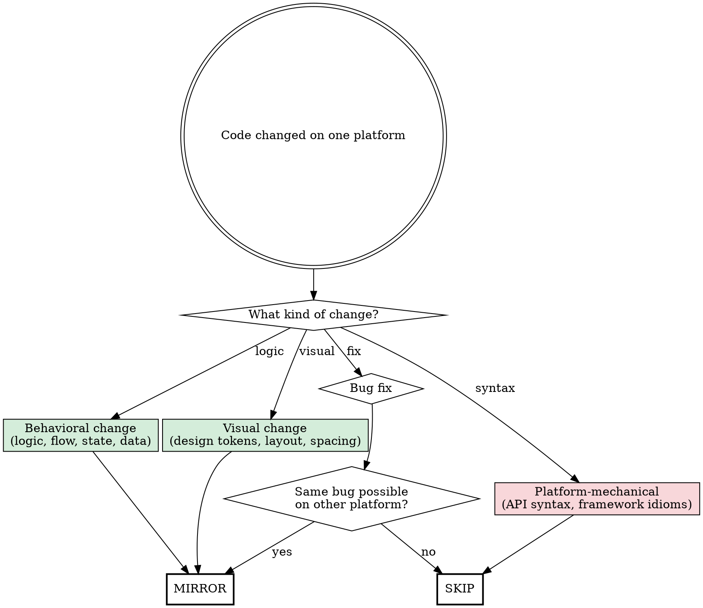

Cross-platform mirror — automatically evaluates code changes on one platform and applies equivalent changes to the other. This skill should be invoked proactively whenever code is written or modified in `platforms/ios/` or `platforms/android/`.

**Trigger:** Any code edit in a platform directory. This skill has a very sensitive trigger — if there is even a small chance a change should be mirrored, invoke it.

---

## When to Mirror vs. Skip

Not every change mirrors. The decision depends on WHAT changed, not WHERE.



### MIRROR these changes:

- **Business logic**: scoring algorithms, thresholds, caps, pagination limits, data processing
- **Data flow**: what gets persisted, when, in what format (e.g., saving deck state for resume)
- **User-facing behavior**: animation timing, gesture thresholds, navigation flow changes
- **API integration**: endpoint URLs, query parameters, request/response parsing
- **Feature additions/removals**: new screens, removed functionality, scope changes
- **Design system values**: colors, spacing, typography, corner radii (via shared spec)
- **State management**: what states exist, transitions between them, error handling

### SKIP these changes:

- **Framework idioms**: `Task.sleep` vs `delay()`, `@Observable` vs `StateFlow`, `withAnimation` vs `AnimatedVisibility`
- **Platform API usage**: `URLSession` vs `HttpURLConnection`, `SwiftData` vs `Room`, `Keychain` vs `EncryptedSharedPreferences`
- **Language syntax**: Swift concurrency patterns vs Kotlin coroutines, `guard let` vs `?.let`
- **Build configuration**: Xcode project settings, Gradle config, SPM vs Maven dependencies
- **Platform-specific bugs**: simulator keychain issues, emulator credential manager fallbacks

### Gray area — use judgment:

- **Error handling strategy**: Mirror the WHAT (which errors to catch, what to show the user), skip the HOW (try/catch syntax)
- **Animation parameters**: Mirror the values (duration, spring damping), skip the API (`withAnimation` vs `animate`)
- **Storage approach**: Mirror the data shape and persistence triggers, skip the storage API

---

## Process

### Step 1 — Identify the change

Read the diff on the changed platform. Summarize:
- What files changed
- What behavior changed (not syntax — behavior)
- Why it changed (bug fix, feature, improvement)

### Step 2 — Classify

For each behavioral change, ask: "If the other platform doesn't have this change, will it behave differently from the user's perspective?"

If yes → mirror. If no → skip.

### Step 3 — Find the equivalent code

On the other platform, locate the file(s) that implement the same feature:
- iOS `Services/SuspicionScorer.swift` ↔ Android `services/SuspicionScorer.kt`
- iOS `Features/SwipeDeck/SwipeDeckView.swift` ↔ Android `features/swipedeck/SwipeDeckScreen.kt`
- iOS `App/AppCoordinator.swift` ↔ Android `navigation/SweepNavGraph.kt`
- iOS `Services/RealGmailService.swift` ↔ Android `services/RealGmailService.kt`

Use the shared specs in `specs/changes/` to understand the intended behavior, not the source platform's implementation details.

### Step 4 — Apply the equivalent change

Write the change using the TARGET platform's idioms:
- Same behavior, different syntax
- Same data flow, different storage API
- Same animation feel, different animation framework

**Do NOT copy-paste and translate.** Implement the same INTENT using the target platform's best practices.

### Step 5 — Build and verify

Build the target platform to verify the change compiles:
- iOS: `xcodebuild -project Sweep.xcodeproj -scheme Sweep ...`
- Android: `cd platforms/android && ./gradlew assembleDebug`

---

## Examples

### Mirror: Suspicion scorer rebalancing
iOS changed scoring weights (Promotions +30, Primary -40, contacts -35).
**Mirror to Android:** Update `SuspicionScorer.kt` with the same weights and threshold.

### Mirror: Deck resume on relaunch
iOS added saving remaining cards to UserDefaults and resuming on launch.
**Mirror to Android:** Save remaining cards to SharedPreferences/Room, check on launch in NavGraph.

### Mirror: Message fetch cap at 500 with 6-month date range
iOS changed Gmail API query from `labelIds=INBOX` to `q=in:inbox after:2025/11/05` and capped at 500.
**Mirror to Android:** Same query change in `RealGmailService.kt`, same cap in scanning ViewModel.

### Skip: Keychain entitlements for simulator
iOS needed `Sweep.entitlements` with `keychain-access-groups` for Google Sign-In on simulator.
**Skip on Android:** This is an iOS-specific signing/entitlements issue. Android doesn't have this concept.

### Skip: DispatchQueue to Task.sleep migration
iOS replaced `DispatchQueue.main.asyncAfter` with `Task { try? await Task.sleep }`.
**Skip on Android:** This is a Swift concurrency idiom change. Android already uses coroutines correctly.

---

## When invoked proactively

When this skill triggers on a code change, output a brief assessment:

```
Mirror check: [file changed]
Change: [one-line description]
Classification: MIRROR / SKIP
Reason: [one line]
```

If MIRROR, proceed with Steps 3-5. If SKIP, just log the assessment and move on.

If multiple files changed, assess each independently — some may mirror while others skip.
