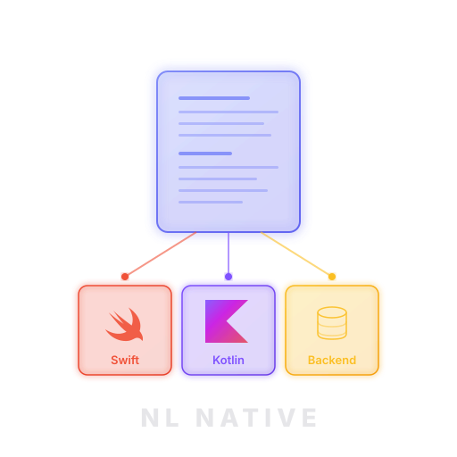

<p align="center">
  
</p>

<p align="center">
  <strong>NL Spec for native app development.</strong><br/>
  <em>Swift for iOS, Kotlin for Android, any backend.</em>
</p>

<p align="center">
  <a href="#quick-start">Quick Start</a> ·
  <a href="#commands">Commands</a> ·
  <a href="#agents">Agents</a> ·
  <a href="example/">Example</a>
</p>

---

React Native and Flutter use a shared codebase. NL Native uses a shared natural language base.

You describe features in plain English. Seven AI agents turn them into native iOS, Android, and backend code, verified against the spec. Slash commands ship for [Claude Code](https://claude.ai/code); [AGENTS.md](./AGENTS.md) and [.cursor/rules/](.cursor/rules/) keep **OpenAI Codex** and **Cursor** on the same harness.

## Quick Start

```bash
# Copy the harness into your project
cp -r nl-native/.claude nl-native/agents nl-native/schemas your-app/

# Create platform directories
mkdir -p your-app/platforms/{ios,android,backend}
mkdir -p your-app/specs/{core,changes}
```

In **Claude Code**, open your project directory and run:

```
/propose user-authentication    # spec the feature, get human approval
/fan-out                        # parallel iOS + Android + Backend implementation
/steer the login feels clunky   # redirect mid-flight if needed
/preview                        # see what was built on the simulator
/verify                         # spec compliance + cross-platform coherence
/archive                        # merge into baseline, harness learns from steers
```

Using **Cursor**, **Codex**, or another coding agent? Follow the same lifecycle with [AGENTS.md](./AGENTS.md) and mirror the intent of the commands in [`.claude/commands/`](./.claude/commands/).

Backend stack (Supabase, Firebase, Cloudflare Workers, etc.) is configured on your first `/fan-out`. iOS and Android use mock data layers during implementation so they never block on the backend.

## Commands

| Command | What it does |
|---|---|
| `/propose <name>` | Plain English → EARS spec → API contracts → interaction spec → human approval. No code until you approve. |
| `/fan-out` | Launches iOS, Android, and Backend agents in parallel. Each writes an implementation spec, task list, then builds. Auto-runs `/connect` when backend finishes. |
| `/steer <feedback>` | Course-correct mid-implementation. Specific feedback amends the spec surgically. Vague feedback ("feels wrong") generates alternatives to pick from. |
| `/preview` | Builds the app, walks through interaction spec states on the simulator/emulator, captures screenshots. |
| `/connect` | Wires mock data layers to the real backend. Smoke-tests endpoints, generates real API clients, reports mismatches. Auto-triggered from `/fan-out`. |
| `/verify` | Phase A: per-platform spec compliance. Phase B: cross-platform coherence, integration verification. |
| `/archive` | Merges specs into stable baseline. Reviews steer log for recurring patterns, proposes permanent AGENTS.md rules. |
| `/adopt <path>` | Reverse-engineers specs from an existing codebase. Extracts contracts, data models, interactions. Brings an existing app into the harness. |
| `/status` | Dashboard: phase, task progress, checkpoints, steers, contract alignment, next step. |

## Agents

Seven agents with strict ownership boundaries. They communicate through specs, never directly with each other during implementation.

| Agent | Owns | Key constraint |
|---|---|---|
| **Spec Analyst** | Feature specs (EARS notation) | Never writes code |
| **Architect** | API contracts, data models, gate reviews | Only agent who bumps contract versions |
| **UX Designer** | Interaction specs, behavioral rules | Defines behavior, not visuals |
| **iOS Expert** | Swift/SwiftUI code, mock data layer | No contact with other platform agents |
| **Android Expert** | Kotlin/Compose code, mock data layer | No contact with other platform agents |
| **Backend Expert** | Endpoints, schema, auth | Service-agnostic at spec level |
| **QA Verifier** | Verification reports | Reports findings, never fixes them |

All cross-cutting decisions route through the Architect. Platform agents never negotiate with each other. This prevents the coherence drift you get when two teams build the same feature independently.

```
         Spec Analyst
              │
      ┌───────┴────────┐
      │                │
  Architect ◄────► UX Designer
      │
  ┌───┼───┐
  │   │   │
 iOS  And  Backend     ← no lateral communication
  │   │   │
  └───┼───┘
      │
  QA Verifier
```

## How `/steer` works

Two modes, auto-detected from your input:

**Amend** (you can describe the change): "use a bottom sheet instead of a full-screen modal"
- Produces a spec delta
- Calculates blast radius across all platforms
- Re-executes only affected tasks

**Diverge** (you know something's wrong but not what): "the note list feels cluttered"
- Generates 3 alternatives with trade-offs
- You pick one (or combine elements)
- Selection becomes a binding constraint in the spec

Checkpoints (committed at milestones during fan-out) give you clean revert points. If a steer would invalidate most completed work, the harness offers to revert to a checkpoint instead.

## Harness evolution

At `/archive` time, the harness reviews your steer log. If you kept correcting the same kind of thing (list rows too dense, wrong navigation pattern), it proposes a permanent rule for your AGENTS.md files. You approve or reject each rule.

Every archived feature makes the next one more aligned with your taste.

## Backend agnosticism

The spec layer uses abstract types (uuid, timestamp, text). The Architect writes contracts that say "POST /api/v1/notes creates a note." The Backend Expert translates that to Supabase Edge Functions, Firebase Cloud Functions, Cloudflare Workers, or a custom Express server, depending on what you configured in `platforms/backend/AGENTS.md`.

Switch services later by updating AGENTS.md and re-running `/fan-out`. The specs don't change.

## Repo structure

```
agents/           7 agent role definitions
schemas/          Spec templates (features, contracts, data models, interactions)
.claude/commands/ 9 slash commands
.claude/skills/   Verification loops (iOS simulator, Android emulator)
example/          Worked example: Notes app feature
```

## FAQ

**What LLM does this require?**
Default slash commands ship for Claude Code; [AGENTS.md](./AGENTS.md) and [.cursor/rules/](.cursor/rules/) map the same harness to Codex and Cursor. Agent profiles and spec formats stay tool-agnostic.

**Can I add more platforms?**
The harness is platform-count-agnostic. Add a `web-expert.md` or `rn-expert.md` for additional targets.

**Can I bring an existing app into this?**
`/adopt <path>` reverse-engineers specs from existing Swift, Kotlin, or backend code.

**Is this code mine?**
The output is standard native code. Engineers can read, modify, and own it. The harness accelerates implementation. It doesn't lock you in.

## Acknowledgements

NL Native's spec-driven workflow builds on ideas from [OpenSpec](https://github.com/Fission-AI/OpenSpec) by Fission AI, a lightweight specification framework for AI-driven development. OpenSpec established the pattern of agreeing on what to build before any code is written, with artifact-guided workflows and slash commands. NL Native extends this with platform-specific agents, contract versioning, mid-flight steering, and cross-platform verification.

## Contributing

PRs welcome for agent profiles, AGENTS.md templates, schema improvements, worked examples, and ports to other agent tools (Cursor, Windsurf).
